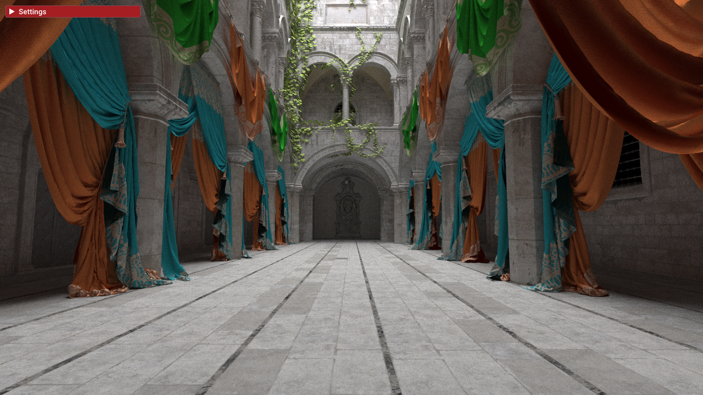
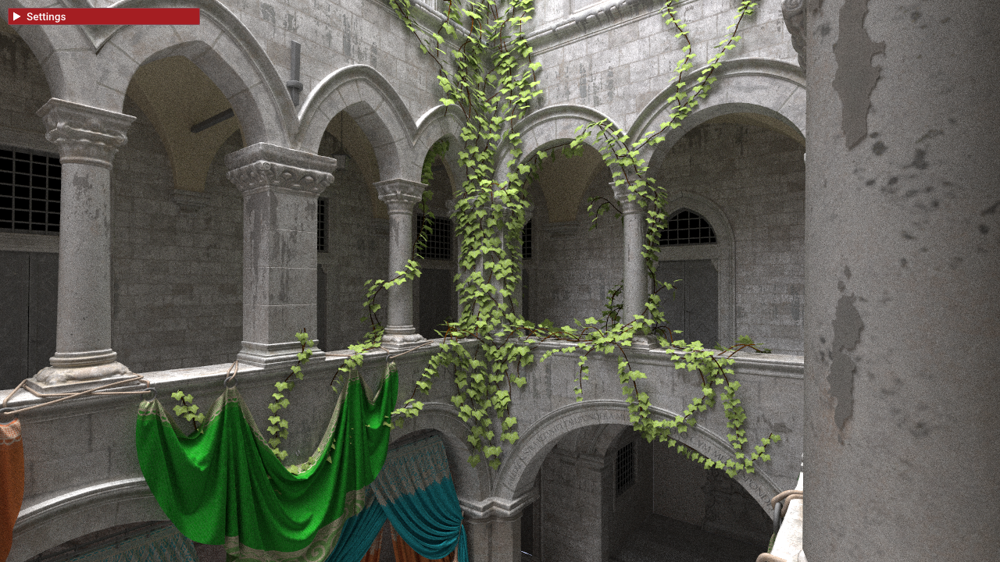
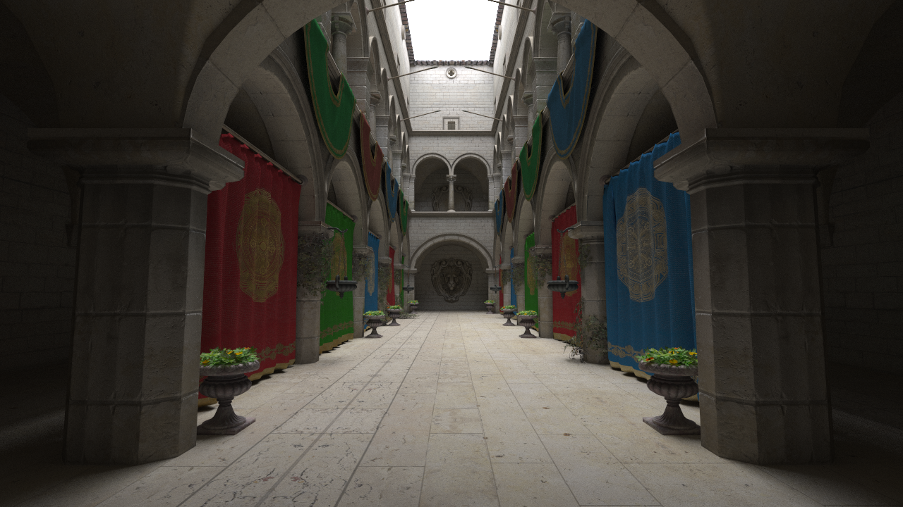
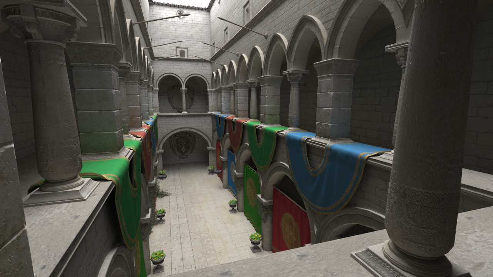
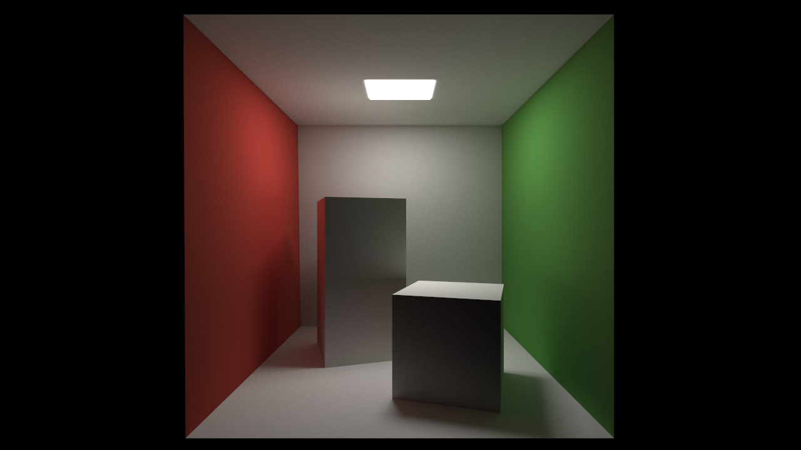

# Vulkan hardware accelerated path tracer

## About

A playground for hardware accelerated path tracing using the official, cross-vendor Khronos ray tracing extensions for Vulkan. Uses glTF as a scene format.

## Note

This is a personal playground, so things will keep changing and breaking.

## Screenshots

### Intel's Sponza 

From https://www.intel.com/content/www/us/en/developer/topic-technology/graphics-research/samples.html

 

### Sponza

From https://github.com/KhronosGroup/glTF-Sample-Models with some minor fixes (e.g. floating flower pots)

   

### Cornell Box

