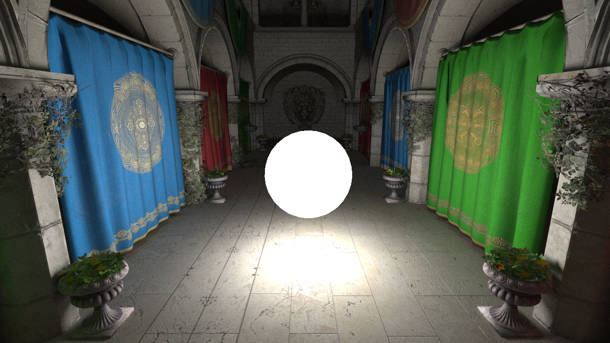

# Vulkan hardware accelerated path tracer

## About

A playground for hardware accelerated path tracing using the official, cross-vendor Khronos ray tracing extensions for Vulkan. Uses glTF as a scene format.

## Note

This is a personal playground, so things will keep changing and breaking.

## Sponza

The Sponza glTF scene has been taken from the [glTF sample models repository](https://github.com/KhronosGroup/glTF-Sample-Models) and has been slightly fixed (e.g. floating flower pots).

## Screenshots

   
